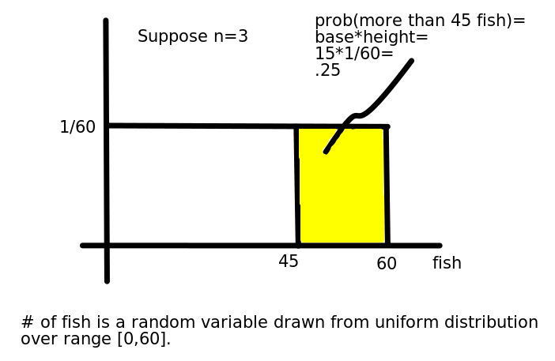

```{r setup, include=FALSE}
knitr::opts_chunk$set(echo = FALSE,message=FALSE,warning=FALSE)
source("ass5_2021_fall.R")
library("DT")
library("knitr")
library("kableExtra")
```
**Section #: `r paste("0",section,sep="")`**


Students must abide by  [UVic
  academic regulations](https://www.uvic.ca/calendar/undergrad/index.php#/policy/Sk_0xsM_V?bc=true&bcCurrent=08%20-%20Policy%20on%20Academic%20Integrity&bcGroup=Undergraduate%20Academic%20Regulations&bcItemType=policies)
 and observe standards of scholarly integrity
(i.e. no plagiarism or cheating). Therefore, this assignment must be
taken individually and not with a friend, classmate, or group. You are
also prohibited from sharing any information about the assignment with
others. I affirm that I will not give or receive any aid on this assignment 
and that all work will be my own. **put your name here**

What the subjects saw: (page 1)

*   Consider a lake where <span class="math inline">\(n \approx 3\)</span> people can catch fish.
*   In this experiment you will play 20 independent rounds of the same one shot game.
*   Each round you are put into a new group of <span class="math inline">\(\approx 3\)</span> people.  
*   In each round your task is to choose how effort to put into fishing <span class="math inline">\(e_i\)</span>.
*   <em>If</em> the stock of fish <span class="math inline">\(f\)</span> exceeds the total effort $f>e_1+e_2+e_3$ then every unit of effort results in one fish caught.
*   However, the stock of fish is unknown: <span class="math inline">\(f\)</span> equally likely to be any real number between <span class="math inline">\(0\)</span> and <span class="math inline">\(20n\)</span>: <span class="math inline">\(f∼U[0,20n]\)</span>
*   If the stock of fish is lower than the total effort <span class="math inline">\(f \leq e_1+e_2+e_3\)</span> the resource is destroyed: all players catch zero fish.
*   The tradeoff: more effort more fish (if there are enough fish) vs. more effort lower probability there are enough fish.
*   For example, suppose that the sum of all the individual effort choices is <span class="math inline">\(e_1+e_2+e_3=45\)</span>: what is the probability there is enough fish?



*   If the total effort is 45, the probability there is enough fish is .25.  


*   The expected profit function for player 1 is:  

\begin{equation}
E[\pi_1]=\left[\alpha e_1+\frac{1-\alpha}{3}(e_1+e_2+e_3)\right]\left(\frac{60-e_1-e_2-e_3}{60}\right)-\frac{e_1}{3}
\end{equation}

*   Inside the first [square] brackets is the amount of fish you receive if there are enough fish.  
*   Inside the second (round) brackets is the probability there are enough fish.  
*   The last term is the cost of effort. 


The treatments:

* Communism ($\alpha=0$):
* Universal Basic Income ($\alpha=\frac12$)
* laissez-faire ($\alpha=1$)

With a bit of a stretch this game would also apply to the issue of fossil fuel extraction. In this case, the threat is not the extinction of some species we have over-harvested, but our own extinction. A feature of both interpretations is an unknown tipping point beyond which we can not recover. Regarding climate change, a tipping point may be the result of positive feedback loops such as methane being released from permafrost as it thaws, and a lowering of the planet's Albedo as we lose snow and ice cover.  In both cases if extraction stays below the tipping point the species in question will survive, otherwise extinction. The temptation to extract more comes from the fact that our material well being is increasing in extraction, as long as we stay below the tipping point.

Unfortunately there was a bug in the code, so the feedback that subjects received after each round did not make much sense.  Because of this we are going to create a partition of the data allowing us to compare the behaviour of subjects on the basis of how much profit they earned, with  the conjecture that some of you figured out what was wrong with the feedback provided, and some of you did not. 

# (10 marks)

**Take the derivative of player 1's expected profit function with respect to $e_1$ and set the derivative equal to zero. Solve for the symmetric equilibrium where $e_i=e^{\star}~\forall~i$. What is the equilibrium prediction for catch size for a group of size 3 for the three treatments? i.e. $\forall \alpha\in\{0,.5,1\}$?**

# (10 marks)

**Suppose that a social planner chooses the total amount of effort $E=e_1+e_2+e_3$.  Recall that player i's consumption (if there are enough fish) is 
$\left[\alpha e_1+\frac{1-\alpha}{3}(e_1+e_2+e_3)\right]$.  What do you get if you add up the consumption for all three players (again, this is assuming there are enough fish)?  Thus, what is the expected welfare in terms of $E$?  Differentiate expected welfare in terms of $E$ and set the derivative to zero.  Solve for $E^{\star\star}$, the socially optimal level of total effort.  If all players exert the same effort level, what is the socially optimal level of effort per person? Why does the socially optimal level of effort not depend on $\alpha$?**


# (10 marks) 

**Explain when and why the equilibrium catch size is different from the socially optimal individual catch size.** 

# (10 marks)

**Create a new dataframe called `subjects` using `mydf` THEN `group_by()` variable `oneid` THEN `summarize()` creating variables `mean_profit` by taking the `mean()` of `profit` and `mean_choice` by taking the `mean()` of choice THEN  `filter` keeping only the rows where it is not true that `mean_profit` `is.na()` THEN `ungroup()` THEN `mutate()` creating variable `top_half` by testing `mean_profit>median(mean_profit)`. Include a copy of your code below: note `eval=FALSE`, so the code must be in your .R file as well.** 

```{r, echo=TRUE, eval=FALSE}

```

# (10 marks)

**Use the function `datatable()` from the library `DT` to show the dataframe `subjects` below. Set `rownames=FALSE` and include `options = list(columnDefs = list(list(className = 'dt-center', targets = "_all")))` in your call to `datatable()`.**

```{r, echo=FALSE}

```

# (10 marks)

**Add the information from `subjects` to `mydf` by performing a `left_join()` of `mydf` and `subjects` THEN get rid of missing values with function `na.omit()`. Include a copy of your code below: note `eval=FALSE`, so the code must be in your .R file as well.** 

```{r echo=TRUE, eval=FALSE}

```

# (10 marks)

**Create boxplots of `choice` for the three levels of `alpha`.  Add the underlying data with some jittering, and a horizontal white line at the equilibrium level of effort.  Facet the plot by variable `top_half`. Give the y axis a more descriptive name.**

```{r, echo=FALSE}
#first_plot
```

# (10 marks)

**Describe the results from the plot above.**

# (10 marks)

**Using dataframe `subjects`, create a scatterplot of `mean_choice` vs. `mean_profit`.  Use `geom_smooth()` to emphasize the relationship, and `facet_wrap()` the plot by variable `alpha`.**

```{r, echo=FALSE}
#second_plot
```

# (10 marks)

**Describe the results from the plot above.**

